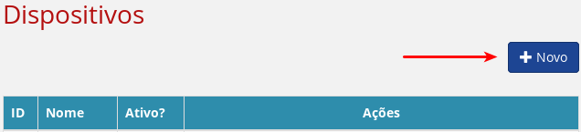
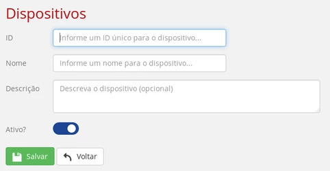
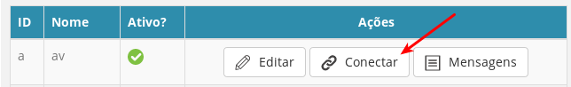
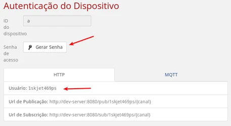
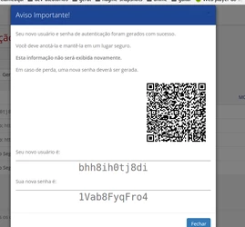

# Guia de Uso da Plataforma Konker

## Índice

## Porque usar uma Plataforma?
Construir soluções de IoT que resolvem problemas do mundo real não é uma tarefá trivial. Em geral, é necessária uma combinação de habilidades:

- OT, ou Operational Technology. Trata-se de entender o problema real que se está tentando resolver e como resolvê-lo no mundo real. Se a solução é uma solução de irrigação na agricultura, é necessário conhecer quais os problemas associados, quais os equipamentos são usados para irrigar, de que forma trabalham, onde estão suas limitações, e assim por diante.
- HW, ou Hardware. Trata-se de construir o equipamento que trabalha como ponte entre OT e a Internet. Esse equipamento, dependendo das condições de trabalho, talvez tenha que ser resistente a humidade, sujeira, vibração, temperatura, conectividade. entre outros aspectos importantes para uma instalação em campo.
- SW, ou Software. Trata-se do I (Internet) em "Internet das Coisas". Construir uma solução de software na Internet capaz de receber, armazenar, processar e analisar grandes volumes de dados, com alta disponibilidade, segurança e desempenho. Gerenciar os dispositivos.

A Plataforma Konker é uma ferramenta que endereça o último ponto desta lista: o Software na Internet. Trata-se de uma Plataforma na nuvem num modelo PaaS (Platform as a Service) que realiza a coleta de dados e a comunicação entre os dispositivos. O objetivo é que o criador de uma solução possa concentrar seus esforços pensando na solução em si, no hardware e no problema que deve ser resolvido - em lugar de desperdiçar tempo realizando setup de servidores, replicação, backup, monitoração e assim por diante. A prototipação de soluções é especialmente simples: em alguns minutos é possível começar a enviar e visualizar dados.

## Conceitos
Para usar a Plataforma Konker, alguns conceitos são importantes:

### Dispositivo
Um dispositivo na Pataforma Konker é uma representação de um dispositivo físico (ou virtual) que envia ou recebe dados. É o equivalente a "Things" quando se fala em "Internet of Things". Apenas dispositivos cadastrados na plataforma podem enviar e receber dados.

### Canal
O conceito de canal está associado ao dispositivo e é uma maneira de agrupar mensagens com conteúdo semelhante para que possam ser tratadas em conjunto. Um exemplo é o caso em que um dispositivo tem 2 sensores: um sensor de umidade e um sensor de temperatura. Nesse caso, é aconselhável que os dados enviados pelo dispositivo sejam enviados para um canal "temperatura" e os dados de umidade para um canal de "umidade". Dessa forma, pode-se aplicar filtros ou visualizações apenas pra um tipo de informação ou de outra. Canais não precisam ser cadastrados: basta informar o nome do canal durante o envio da informação que ele será automaticamente criado a partir daquele momento.
Os canais também são relevantes para o dispositivo que recebe os dados. Suponha que um dispositivo receba da plataforma 2 tipos de informação, como por exemplo comandos e configurações. Nesse caso, o dispositivo pode fazer uma assinatura para receber apenas os dados de comandos ou apenas os dados de configuração. Os nomes de canais podem ser definidos com os caracteres de A a Z maiúsculos ou minúsculos, numerais de 0 a 9 e os caracteres especiais '-' e '_'. Espaços não são permitidos.

### Rota
Uma rota é um caminho que liga um dispositivo de entrado a um dispositivo (ou webservice) de saída. Dessa forma, se há um dispositivo que contém um botão chamado "Botao 01" e um dispositivo que contém um LED chamado "LED 01", pode-se criar uma rota que liga o dispositivo "Botao 01" ao dispositivo "LED 01", de forma que as mensagens enviadas ao pressionar o botao sejam encaminhadas ao dispositivo que acende ou apaga o LED. Nesse cenário, também seria necessário especificar na rota qual o canal em que os dispositivos se comunicam.

### Transformação
Um ponto de transformação permite que uma mensagem seja arbitrariamente manipulada durante o processamento da rota para que ela esteja no formato que o dispositivo de saída possa entender. Isso é realizado através de chamadas a serviços externos à plataforma que devem receber as mensagens, processá-las e devolvê-las à plataforma para continuar o processamento. Ver "Adicionando Comportamento Personalizado" para mais informações.

### Como Usar
#### Registrando seu Dispositivo
Antes de começar a enviar dados, o dispositivo precisa ser registrado na Plataforma Konker. O processo de registro é simples: a partir do Menu Principal, na tela de Dispositivos, basta adicionar um Novo Dispositivo.

O cadastro é muito simples e rápido, basta informar:

- Device ID: um ID único para aquele dispositivo. Como número serial, um identificador sequencial, qualquer informação que possa identificar unicamente aquele dispositvo;
- Device Name: um nome amigável para o dispositivo.
- Descrição: um texto mais longo do que é o dispositivo, o que ele faz e assim por diante;
- Ativo: se esse dispositivo pode enviar ou receber dados. 
Dispositivos inativos não podem enviar ou receber dados.

Após registrar o dispositivo, é necessário solicitar as credenciais de acesso. Tais credenciais são usadas para que o dispositivo faça a autenticação. Trata-se de um usuário e uma senha que estão associados de forma intransferível àquele dispositivo. Se um usuário tem 10 dispositivos cadastrados, cada um desses dispositivo terão um usuário de dispositivo e uma senha de dispositivo associados. A geração das credenciais estão no botão Conectar:

Clicando no botão "Gerar Senha", uma nova senha será gerada para aquele dispositivo. O usuário está no campo "Usuário" destacado.

IMPORTANTE: Quando a senha for gerada, copie e salve tanto o usuario quanto a senha em um local seguro. A Plataforma Konker não armazena essa senha por questões de segurança (armazena apenas o hash criptográfico) e portanto não é possível recuperá-la. Caso a senha seja perdida, uma nova senha deverá ser gerada.

Nesse exemplo específico, sempre que  o dispositivo precisar enviar dados (HTTP ou MQTT), deve usar como username bhh8ih0tj8di e senha 1Vab8FyqFro4. 
Para os seus dispositivos, usuário e senha serão diferentes.